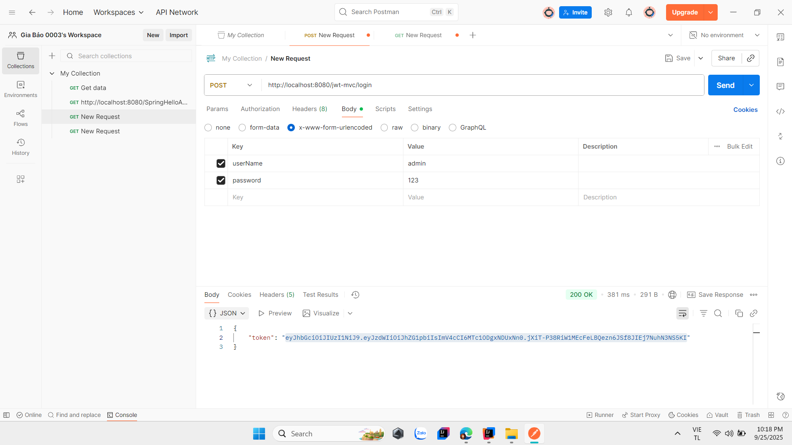
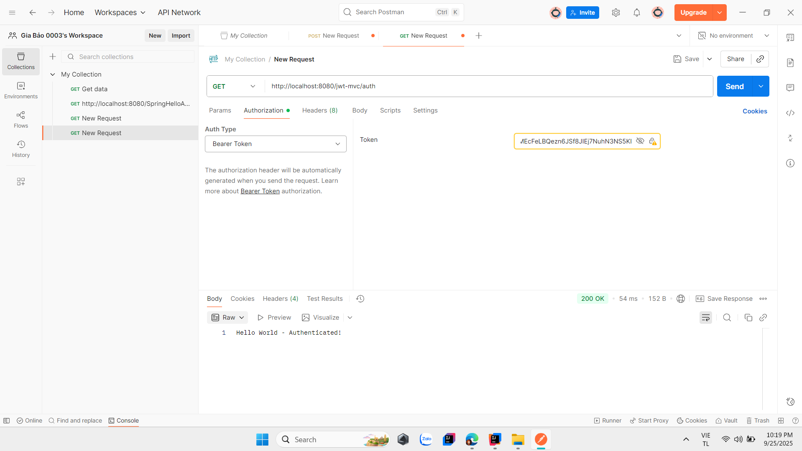

    # Test API bằng Postman (Xác thực Token)

Đầu tiên, thực hiện các bước sau để kiểm tra API:

1. Chọn phương thức **POST** với link: `http://localhost:8080/jwt-mvc/login`.
2. Nhấp vào tab **Body**, chọn **x-www-form-urlencoded**.
3. Nhập lần lượt **Key** và **Value**:
    - Key: `username`, Value: tên tài khoản (ví dụ: `admin`).
    - Key: `password`, Value: mật khẩu (ví dụ: `123`).
4. Nhấn **Send** để gửi yêu cầu và lấy token từ phản hồi (như hình ảnh 1).

Tiếp theo, tạo yêu cầu **GET** để xác thực token:
1. Chọn phương thức **GET** với link: `http://localhost:8080/jwt-mvc/auth`.
2. Chuyển sang tab **Authorization**.
3. Chọn **Auth Type** là **Bearer Token**.
4. Dán token đã lấy từ bước trên vào trường **Token**.
5. Nhấn **Send** để kiểm tra.

### Hình ảnh minh họa:
- Hình ảnh 1: 
- Hình ảnh 2: 